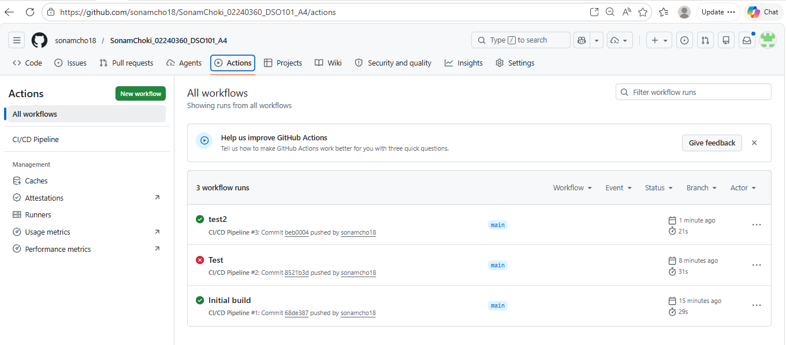

https://github.com/sonamcho18/SonamChoki_02240360_DSO101_A4.git

# Simple Flask CI/CD App

## Introduction
This is a small Flask app made for a CI/CD practice assignment. It provides two endpoints: a home page and a health check. The project also includes basic tests and a GitHub Actions workflow.

## Image 
This image is where it shows it can be tested

## Conclusion
This project is a simple example of a Flask app with tests and CI/CD. It is easy to run, easy to test, and good for learning the basics.

