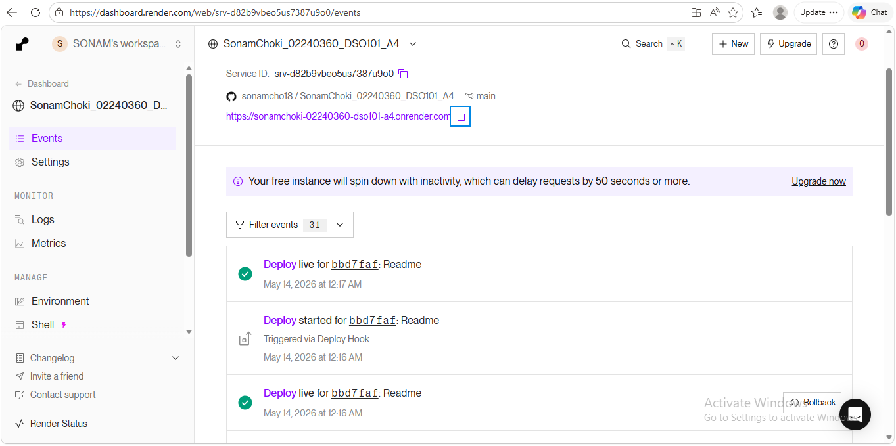

## GitHub Repo
https://github.com/sonamcho18/SonamChoki_02240360_DSO101_A4.git

## Workflow File
See the GitHub Actions workflow in [.github/workflows/ci.yml](.github/workflows/ci.yml).

# Simple Flask CI/CD App

## Introduction
This is a small Flask app made for a CI/CD practice assignment. It provides two endpoints: a home page and a health check. The project also includes basic tests and a GitHub Actions workflow.

## Test Output Screenshot
This image shows the test output.

## Live App URL
Add your live URL here (https://sonamchoki-02240360-dso101-a4.onrender.com)

## Conclusion
This project is a simple example of a Flask app with tests and CI/CD. It is easy to run, easy to test, and good for learning the basics.

